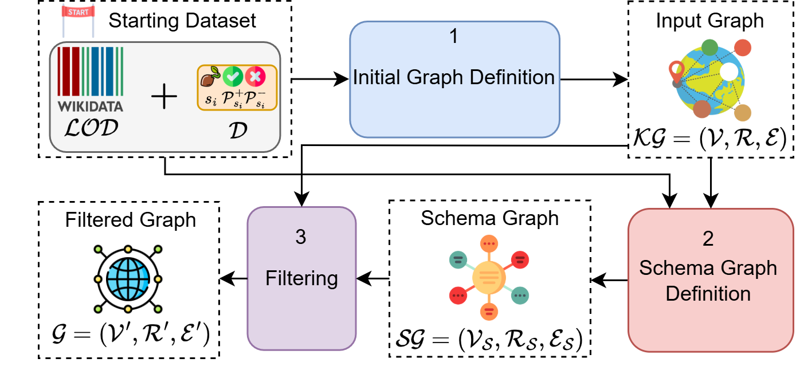
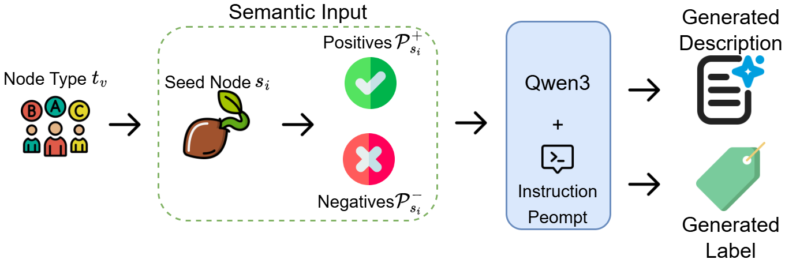
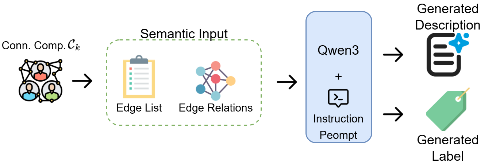
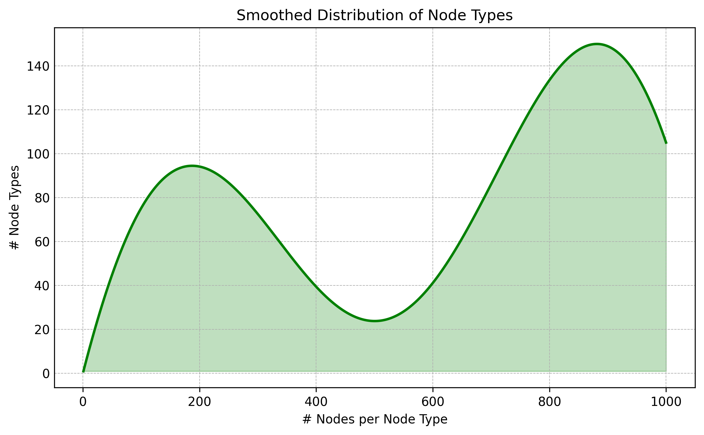
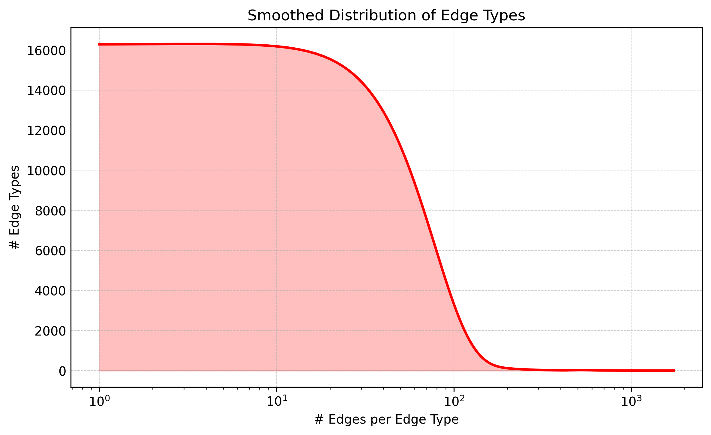
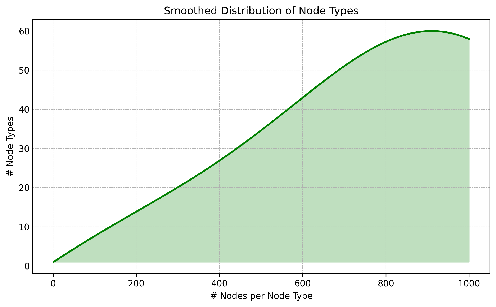
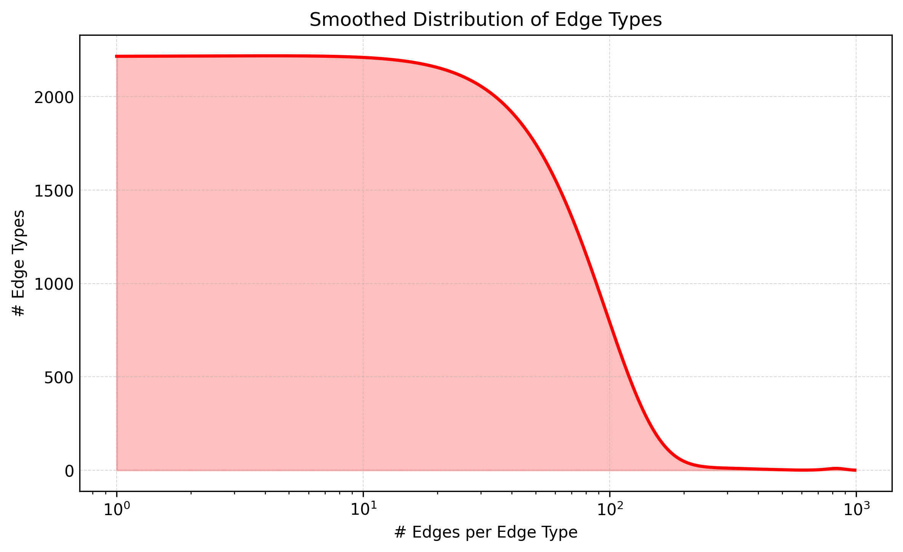

<p align="center">
    
</p>


# KG4FUN
<!-- Put here the license -->

<a target="_blank" href="https://cookiecutter-data-science.drivendata.org/">
    
</a>


**KG4FUN** is a general-purpose pipeline for extracting datasets to tackle the *Knowledge Graph Funneling (KGF)* task. It can be applied to any input Linked Open Data (LOD) source to generate a supervised dataset for KGF.  
In this work, we instantiate the pipeline using the [Wikidata Thematic Subgraph Selection Dataset](https://zenodo.org/records/8091584).
<!-- Add here the link to the Zenodo dataset-->

# Pipeline Overview

<p align="center">
    
</p>


The pipeline takes two inputs — a **LOD graph** and a **seed-centric dataset** (encoding positive and negative relevance decisions per seed node) — and produces three outputs through sequential stages:

1. **Initial Graph Definition**: The input $\mathcal{LOD}$ and dataset $\mathcal{D}$ are combined to construct the starting knowledge graph $\mathcal{KG} = (\mathcal{V}, \mathcal{R}, \mathcal{E})$, which includes both relevant and irrelevant entities and relations, ensuring the filtering task is non-trivial.

2. **Schema Graph Definition**: A domain-specific schema graph $\mathcal{SG} = (\mathcal{V}{\mathcal{S}}, \mathcal{R}{\mathcal{S}}, \mathcal{E}{\mathcal{S}})$ is derived from the seed nodes and their associated positive/negative sets, defining the target node and edge types that the filtered graph must conform to.

3. **Filtered Graph**: Given KG and SG, the ground-truth filtered graph $\mathcal{G} = (\mathcal{V}', \mathcal{R}', \mathcal{E}')$ is constructed by selecting and relabeling only those nodes and edges from KG that are consistent with the structural and semantic constraints encoded in SG.

> **Note:** While the pipeline is fully general and can accommodate any LOD source and relevance dataset D, in this project we instantiate it using **Wikidata** as the LOD graph and the **[Wikidata Thematic Subgraph Selection Dataset](https://doi.org/10.5281/zenodo.8091584)** as D.

Together, these three artifacts — $\mathcal{KG}$, $\mathcal{SG}$, and $\mathcal{G}$ — form a single benchmark instance, enabling reproducible training and evaluation of Knowledge Graph Filtering models.


# LLM-based Schema Labeling

| | |
|:--:|:--:|
|  |  |
| Node Type labeling Pipeline | Edge Type labeling Pipeline |

Once the structural components of the schema graph SG are defined, node and edge types are unlabeled abstractions. To assign meaningful, human-interpretable identifiers, we leverage **[Qwen3](https://arxiv.org/abs/2505.09388)** in two dedicated pipelines:

- **Node type labeling**: the model is provided with a seed node, a set of positive examples, and a set of negative examples. It is instructed to infer the lowest-level abstraction that semantically covers all positive instances while excluding negative ones, producing a concise label and description for each node type.

- **Edge type labeling**: relations sharing schema-level dependencies are first grouped into connected components via a relational graph. The model is then prompted with each component's relations and their interconnections, merging them into a single coherent edge type label and description that captures their shared relational semantics.

This labeling step ensures that the resulting schema is not only structurally well-defined but also semantically interpretable, facilitating both downstream usage and human understanding of the benchmark.


# Reproducibility

This section is intended to support developers in reproducing the KG4FUN benchmark
from scratch. Each step of the pipeline is documented in detail, from environment
setup to the generation of the final filtered graph G.

## Evironment setup
All dependencies are managed via [uv](https://github.com/astral-sh/uv). To build the virtual environment and ensure that all packages are installed with the correct versions, run:

```bash
uv sync
```

To set up the Wikidata backend, we use [QLever](https://github.com/ad-freiburg/qlever) to build a fully portable and reproducible local Wikidata instance:

```bash
./scripts/data/install_wikidata.sh
```

Finally, download the **Wikidata Thematic Subgraph Selection Dataset** by running:

```bash
./scripts/data/download_dataset.sh
```

> **Note:** `download_dataset.sh` downloads and extracts the dataset zip file from [Zenodo](https://doi.org/10.5281/zenodo.8091584). Make sure you have a stable internet connection before running it.

---

### Pipeline Execution

The full dataset generation pipeline can be executed by running the following two scripts:

```bash
./scripts/data/generate-datasetX.sh
./scripts/summarization/summarize-datasetX.sh
```

where `datasetX` can be either `dataset1` or `dataset2`. The first script produces the complete dataset supervision, while the second generates the LLM-based labels and descriptions for node and edge types. All outputs are stored under `data/processed/datasetX/`.

---

#### Node Artifacts

| File | Description |
|------|-------------|
| `nodes.json` | All nodes in $\mathcal{KG}$ with their supervision label (`cls_idx`). A value of `-1` means the node is discarded; any other value maps the node to a target node class. |
| `node_types.json` | Node type definitions, each grouping a seed node with its positive and negative examples. Used to derive the schema node types in $\mathcal{SG}$. |
| `node_info.json` | Human-readable metadata (label, comment, description) for each node in `nodes.json`. |
| `node_type_info.json` | Human-readable metadata for schema-level nodes (seeds, positives, negatives). |
| `node_types/summarization/qwen3-8b/node_type_info.json` | LLM-generated labels and descriptions for each node type. |

<details>
<summary>📄 Example entries</summary>

**`nodes.json`**
```json
{
    "qid": "Q1071187",
    "itemLabel": "Evolved HSPA",
    "cls_idx": 0
}
```

**`node_types.json`**
```json
"Q204833": {
    "positive": [
        { "QID": "Q26763979", "label": "mobile phone network standard", "depth": 1 },
        { "QID": "Q1023122",  "label": "CDMA2000", "depth": 2 }
    ],
    "negative": [],
    "cls_idx": 0
}
```

**`node_info.json`**
```json
"Q1071187": {
    "itemLabel": "Evolved HSPA",
    "itemComment": "-",
    "itemDescription": "technical standard for wireless, broadband telecommunication"
}
```

**`node_type_info.json`**
```json
"Q204833": {
    "itemLabel": "Enhanced Data Rates for GSM Evolution",
    "itemComment": "-",
    "itemDescription": "digital mobile phone technology that allows improved data transmission rates as a backward-compatible extension of GSM"
}
```

**`node_types/summarization/qwen3-8b/node_type_info.json`**
```json
{
    "idx": 0,
    "thinking": "",
    "itemLabel": "Mobile phone standard.",
    "itemDescription": "A telecommunications standard for mobile data transmission and voice communication, encompassing technologies that extend and enhance GSM capabilities."
}
```
</details>

---

#### Edge Artifacts

| File | Description |
|------|-------------|
| `edges/partition/part_idx.json` | Partitioned edge storage for scalable memory management. Each entry encodes an edge with its predicted type, head/tail node QIDs, and supervision signal. |
| `edges/edge_info.json` | Human-readable metadata (label, comment, description) for each relation type appearing in $\mathcal{KG}$. |
| `edges/edge_types.json` | Supervision signals for each detected edge type, including head/tail node class indices and target label. |
| `edges/connected_components.json` | Connected components of the relational graph, encoding the groupings of semantically related relations used to derive abstract edge types. |
| `edges/edge_component_mapping.json` | Compact mapping from each edge type to its corresponding connected component ID. |
| `edge_types/summarization/qwen3-8b/edge_type_info.json` | LLM-generated labels and descriptions for each abstract edge type. |

<details>
<summary>📄 Example entries</summary>

**`edges/partition/part_idx.json`**
```json
{
    "edge_type": {
        "pid": "P366",
        "label": "has use",
        "head_cls": 2,
        "tail_cls": 15,
        "target": "1"
    },
    "head_qid": "Q16934505",
    "tail_qid": "Q58199"
}
```

**`edges/edge_info.json`**
```json
"P101": {
    "itemLabel": "field of work",
    "itemComment": "-",
    "itemDescription": "specialization of a person or organization; see P106 for the occupation"
}
```

**`edges/edge_types.json`**
```json
{
    "pid": "P101",
    "label": "field of work",
    "head_cls": 381,
    "tail_cls": 379,
    "target": "1"
}
```

**`edges/connected_components.json`**
```json
{
    "component_id": 0,
    "edge_types": [
        [0, "P144", 0],
        [0, "P737", 0]
    ],
    "edges": [
        ["P144", "related property", "P737"],
        ["P737", "related property", "P144"]
    ]
}
```

**`edges/edge_component_mapping.json`**
```json
{
    "edge_type": [0, "P144", 0],
    "component_id": 0
}
```

**`edge_types/summarization/qwen3-8b/edge_type_info.json`**
```json
{
    "idx": 0,
    "thinking": "",
    "itemLabel": "InfluenceBasedOn",
    "itemDescription": "Mobile phone standards influence or are influenced by other standards or works they are based on, showing a bidirectional relationship between foundational and derivative technologies."
}
```
</details>


## Dataset Statistics

| | |
|:--:|:--:|
|  |  |
|  |  |

*Node (left) and edge (right) type distributions for Dataset 1 (top) and Dataset 2 (bottom), showing smoothed class cardinalities.*

These structural distributions characterize both **Dataset 1** and **Dataset 2** filtered graphs. The former shows a more heterogeneous node-type distribution, whereas the latter is more uniform. In both cases, edge types exhibit a long-tail distribution, with few high-frequency relations and many low-frequency ones, making the task more challenging.


<div align="center">

|          | $\vert\mathcal{V}\vert$|   $\vert\mathcal{E}\vert$ |$\vert\mathcal{R}\vert$ |$\vert\mathcal{V}_{\mathcal{S}}\vert$|$\vert\mathcal{E}_{\mathcal{S}}\vert$|$\vert\mathcal{R}_{\mathcal{S}}\vert$|$\vert\mathcal{V}'\vert$|$\vert\mathcal{E}'\vert$|$\vert\mathcal{R}'\vert$|
|:---------|-----------:|-----------:|---------------------:|-----------:|-----------:|---------------------:|----------:|----------:|--------------------:|
| Dataset1 |     304982 |     299193 |                46295 |       5030 |      58868 |                    2 |    233013 |    249186 |               29434 |
| Dataset2 |      82044 |      59393 |                 6568 |       1279 |       8606 |                    2 |     72915 |     54920 |                4303 |

</div>

This table highlights the KG4FUN statistics. While $\mathcal{KG}$ exhibits large scale and high relational diversity—especially in **Dataset 1**—the corresponding schema graphs $\mathcal{SG}$ remain compact. The filtered graphs $\mathcal{G}$ retain a substantial portion of nodes and edges, while significantly reducing the number of relation types, reflecting the aggregation of fine-grained predicates into higher-level abstractions.

## LLM-Generation
<table>
  <thead>
    <tr>
      <th colspan="2" align="center">Dataset</th>
      <th colspan="5" align="center">Negative</th>
      <th colspan="5" align="center">Positive</th>
      <th colspan="5" align="center">Seed</th>
    </tr>
    <tr>
      <th colspan="2"></th>
      <th align="center">R@1</th><th align="center">R@2</th><th align="center">R@L</th><th align="center">R@LS</th><th align="center">SEM</th>
      <th align="center">R@1</th><th align="center">R@2</th><th align="center">R@L</th><th align="center">R@LS</th><th align="center">SEM</th>
      <th align="center">R@1</th><th align="center">R@2</th><th align="center">R@L</th><th align="center">R@LS</th><th align="center">SEM</th>
    </tr>
  </thead>
  <tbody>
    <tr>
      <td rowspan="2" align="center"><b>Dataset1</b></td>
      <td>descriptions</td>
      <td align="center">0.03</td><td align="center">0.00</td><td align="center">0.03</td><td align="center">0.03</td><td align="center">0.22</td>
      <td align="center">0.17</td><td align="center">0.07</td><td align="center">0.16</td><td align="center">0.16</td><td align="center">0.52</td>
      <td align="center">0.16</td><td align="center">0.03</td><td align="center">0.13</td><td align="center">0.13</td><td align="center">0.44</td>
    </tr>
    <tr>
      <td>labels</td>
      <td align="center">0.04</td><td align="center">0.01</td><td align="center">0.04</td><td align="center">0.04</td><td align="center">0.23</td>
      <td align="center">0.46</td><td align="center">0.26</td><td align="center">0.46</td><td align="center">0.46</td><td align="center">0.65</td>
      <td align="center">0.09</td><td align="center">0.02</td><td align="center">0.09</td><td align="center">0.09</td><td align="center">0.33</td>
    </tr>
    <tr>
      <td rowspan="2" align="center"><b>Dataset2</b></td>
      <td>descriptions</td>
      <td align="center">0.03</td><td align="center">0.00</td><td align="center">0.02</td><td align="center">0.02</td><td align="center">0.14</td>
      <td align="center">0.07</td><td align="center">0.02</td><td align="center">0.07</td><td align="center">0.07</td><td align="center">0.47</td>
      <td align="center">0.13</td><td align="center">0.02</td><td align="center">0.11</td><td align="center">0.11</td><td align="center">0.46</td>
    </tr>
    <tr>
      <td>labels</td>
      <td align="center">0.02</td><td align="center">0.01</td><td align="center">0.02</td><td align="center">0.02</td><td align="center">0.15</td>
      <td align="center">0.18</td><td align="center">0.07</td><td align="center">0.18</td><td align="center">0.18</td><td align="center">0.52</td>
      <td align="center">0.02</td><td align="center">0.01</td><td align="center">0.02</td><td align="center">0.02</td><td align="center">0.37</td>
    </tr>
  </tbody>
</table>

<div align="center">
<table>
  <thead>
    <tr>
      <th colspan="2">Dataset</th>
      <th>R@1</th>
      <th>R@2</th>
      <th>R@L</th>
      <th>R@LS</th>
      <th>SEM</th>
    </tr>
  </thead>
  <tbody>
    <tr>
      <td rowspan="2">Dataset 1</td>
      <td>descriptions</td>
      <td>0.13</td>
      <td>0.02</td>
      <td>0.11</td>
      <td>0.11</td>
      <td>0.26</td>
    </tr>
    <tr>
      <td>labels</td>
      <td>0.63</td>
      <td>0.45</td>
      <td>0.63</td>
      <td>0.63</td>
      <td>0.52</td>
    </tr>
    <tr>
      <td rowspan="2">Dataset 2</td>
      <td>descriptions</td>
      <td>0.12</td>
      <td>0.02</td>
      <td>0.10</td>
      <td>0.10</td>
      <td>0.31</td>
    </tr>
    <tr>
      <td>labels</td>
      <td>0.52</td>
      <td>0.30</td>
      <td>0.52</td>
      <td>0.52</td>
      <td>0.55</td>
    </tr>
  </tbody>
</table>
</div>

The results reported illustrate a good performance of LLM node type generation, with consistently higher ROUGE and semantic scores for label-based inputs compared to descriptions, indicating that more structured signals better support lexical alignment. Importantly, performance is strongest in the positive and seed settings, while negative samples consistently yield lower scores, confirming that the model effectively captures meaningful associations while distinguishing irrelevant or contrasting concepts. Semantic similarity scores are relatively stable, suggesting reliable semantic alignment even when lexical overlap varies.

<!-- Insert citation here -->